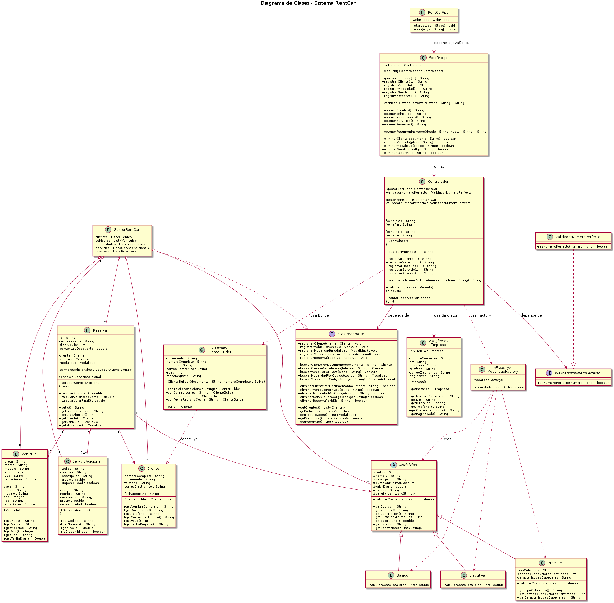

# RentCar - Sistema de Gestión de Alquiler de Vehículos

## 1. Descripción del proyecto

RentCar es una aplicación desarrollada en Java con JavaFX y WebView para gestionar el alquiler de vehículos.

El sistema permite administrar la información de la empresa, registrar clientes, vehículos, modalidades de alquiler, servicios adicionales y reservas. También permite realizar consultas específicas, como la validación de números perfectos a partir del teléfono de un cliente y el cálculo de ingresos obtenidos en un periodo determinado.

La interfaz gráfica está construida con HTML, CSS y JavaScript, mientras que la lógica de negocio y la gestión de la información se realizan en Java.

---

## 2. Objetivo

Desarrollar un sistema de gestión de alquiler de vehículos aplicando programación orientada a objetos, arquitectura MVC, principios SOLID y patrones de diseño creacionales.

El sistema busca separar correctamente las responsabilidades entre la interfaz gráfica, el controlador y las clases que conforman el modelo del dominio.

---

## 3. Funcionalidades principales

El sistema permite:

- Registrar y actualizar los datos de la empresa.
- Registrar clientes.
- Registrar vehículos.
- Registrar modalidades de alquiler.
- Gestionar modalidades Económica, Ejecutiva y Premium.
- Registrar servicios adicionales.
- Crear reservas.
- Asociar servicios adicionales a una reserva.
- Aplicar descuentos porcentuales.
- Calcular el valor total de una reserva.
- Consultar clientes por número telefónico.
- Determinar si el teléfono de un cliente corresponde a un número perfecto.
- Consultar los ingresos obtenidos entre dos fechas.
- Eliminar clientes, vehículos, modalidades, servicios y reservas.
- Visualizar los registros desde una interfaz gráfica web integrada con JavaFX.

---

# 4. Pensamiento computacional

Para el desarrollo de RentCar se aplicaron los principales componentes del pensamiento computacional: descomposición, reconocimiento de patrones, abstracción y diseño de algoritmos.

## 4.1 Descomposición

El problema general de administrar una empresa de alquiler de vehículos fue dividido en problemas más pequeños y manejables.

Se identificaron los siguientes módulos:

- Gestión de la empresa.
- Gestión de clientes.
- Gestión de vehículos.
- Gestión de modalidades de alquiler.
- Gestión de servicios adicionales.
- Gestión de reservas.
- Cálculo del valor de una reserva.
- Aplicación de descuentos.
- Consulta de ingresos por periodo.
- Consulta de clientes por teléfono.
- Validación de números perfectos.

Esta división permitió desarrollar y probar cada responsabilidad de forma independiente.

Por ejemplo, la clase `Reserva` se encarga de representar una reserva y calcular sus valores, mientras que `GestorRentCar` administra las colecciones de entidades registradas en el sistema.

---

## 4.2 Reconocimiento de patrones

Durante el análisis se identificaron comportamientos y estructuras repetitivas.

Un ejemplo corresponde a las modalidades de alquiler:

- Económica.
- Ejecutiva.
- Premium.

Todas comparten características como:

- Código.
- Nombre.
- Descripción.
- Duración mínima.
- Valor diario.
- Estado.
- Beneficios.

Por esta razón se creó una clase abstracta `Modalidad`, de la cual heredan `Basico`, `Ejecutiva` y `Premium`.

También se identificó que todas las entidades principales necesitan operaciones comunes de registro, búsqueda y eliminación, por lo que estas responsabilidades fueron centralizadas mediante `IGestorRentCar` y `GestorRentCar`.

---

## 4.3 Abstracción

Se representaron únicamente las características necesarias de cada elemento del sistema.

Por ejemplo, un cliente se representa mediante:

- Nombre completo.
- Documento.
- Teléfono.
- Correo electrónico.
- Edad.
- Fecha de registro.

Un vehículo se representa mediante:

- Placa.
- Marca.
- Modelo.
- Año.
- Tipo.
- Tarifa diaria.

Una reserva abstrae la relación entre:

- Cliente.
- Vehículo.
- Modalidad.
- Servicios adicionales.
- Fecha.
- Días de alquiler.
- Descuento.

También se utilizaron interfaces como:

`IGestorRentCar`

e

`IValidadorNumeroPerfecto`

para abstraer comportamientos y permitir que las clases dependan de contratos en lugar de implementaciones concretas.

---

## 4.4 Diseño de algoritmos

Se diseñaron diferentes algoritmos para resolver las funcionalidades requeridas.

### Cálculo de una reserva

El valor de una reserva se obtiene mediante:

1. Se calcula el costo de la modalidad de acuerdo con el número de días.
2. Se suman los servicios adicionales seleccionados.
3. Se calcula el subtotal.
4. Se calcula el valor del descuento.
5. Se resta el descuento del subtotal.

Conceptualmente:

```text
Costo base = valor diario × días

Subtotal = costo base + servicios adicionales

Descuento = subtotal × porcentaje / 100

Total = subtotal - descuento
```

### Ingresos por periodo

Para calcular los ingresos:

1. Se recibe una fecha inicial.
2. Se recibe una fecha final.
3. Se recorren las reservas registradas.
4. Se verifica cuáles están dentro del intervalo.
5. Se suman sus valores finales.

### Número perfecto

El sistema permite determinar si el número telefónico de un cliente es un número perfecto.

El algoritmo:

1. Convierte el teléfono a un valor numérico.
2. Obtiene sus divisores propios.
3. Suma los divisores.
4. Compara la suma con el número original.
5. Si ambos valores son iguales, el número es perfecto.

---

# 5. Arquitectura MVC

El sistema utiliza una organización basada en el patrón Modelo-Vista-Controlador.

## Vista

La interfaz está compuesta por:

```text
rentcar.html
styles.css
script.js
```

La vista se encarga de:

- Mostrar formularios.
- Mostrar tablas.
- Capturar información ingresada por el usuario.
- Mostrar mensajes.
- Actualizar visualmente los registros.

La vista no administra directamente las colecciones principales del sistema.

---

## Controlador

La clase:

```text
Controlador
```

coordina las acciones solicitadas desde la interfaz.

Entre sus responsabilidades se encuentran:

- Registrar clientes.
- Registrar vehículos.
- Crear modalidades.
- Registrar servicios.
- Crear reservas.
- Consultar ingresos.
- Consultar números perfectos.

El controlador delega el almacenamiento de información a `IGestorRentCar`.

---

## Modelo

El modelo está compuesto principalmente por:

```text
Empresa
Cliente
Vehiculo
ServicioAdicional
Reserva
Modalidad
Basico
Ejecutiva
Premium
GestorRentCar
```

Estas clases representan las entidades y reglas de negocio del sistema.

---

## Adaptador Web

La clase:

```text
WebBridge
```

funciona como adaptador entre JavaScript y Java.

El flujo general es:

```text
HTML
 ↓
JavaScript
 ↓
WebBridge
 ↓
Controlador
 ↓
Servicios / Modelo
```

De esta manera, la interfaz web puede utilizar las clases Java mediante el `WebView` de JavaFX.

---

# 6. Principios SOLID

## S - Single Responsibility Principle

Cada clase tiene una responsabilidad definida.

Ejemplos:

`Reserva`:

- Representa una reserva.
- Calcula subtotal, descuento y valor final.

`GestorRentCar`:

- Administra las colecciones del sistema.

`ValidadorNumeroPerfecto`:

- Se encarga exclusivamente de determinar si un número es perfecto.

`WebBridge`:

- Se encarga de adaptar la comunicación entre JavaScript y Java.

`Controlador`:

- Coordina los casos de uso del sistema.

Esto evita concentrar toda la funcionalidad en una sola clase.

---

## O - Open/Closed Principle

La clase abstracta:

```text
Modalidad
```

permite agregar nuevas modalidades sin modificar las clases que utilizan una modalidad.

Actualmente existen:

```text
Basico
Ejecutiva
Premium
```

En el futuro se podría agregar:

```text
ModalidadEmpresarial
```

heredando de `Modalidad`, sin modificar la clase `Reserva`.

---

## L - Liskov Substitution Principle

Las clases:

```text
Basico
Ejecutiva
Premium
```

heredan de:

```text
Modalidad
```

Por lo tanto, cualquier instancia de estas clases puede utilizarse donde se espera un objeto de tipo `Modalidad`.

Por ejemplo, `Reserva` trabaja con:

```java
private Modalidad modalidad;
```

y no necesita conocer qué implementación concreta fue seleccionada.

---

## I - Interface Segregation Principle

Se utilizan interfaces específicas para responsabilidades diferentes.

Por ejemplo:

```text
IGestorRentCar
```

define operaciones relacionadas con la administración de las entidades del sistema.

Mientras que:

```text
IValidadorNumeroPerfecto
```

define únicamente:

```java
boolean esNumeroPerfecto(long numero);
```

De esta manera, ninguna clase está obligada a implementar funcionalidades que no necesita.

---

## D - Dependency Inversion Principle

La clase `Controlador` depende de abstracciones:

```java
private final IGestorRentCar gestorRentCar;

private final IValidadorNumeroPerfecto validadorNumeroPerfecto;
```

y no directamente de:

```text
GestorRentCar
ValidadorNumeroPerfecto
```

Las implementaciones concretas son creadas en `RentCarApp` e inyectadas al controlador.

Esto reduce el acoplamiento entre las clases.

---

# 7. Patrones de diseño

## 7.1 Singleton - Empresa

La empresa debe representar una única organización dentro de la aplicación.

Por esta razón se implementó el patrón Singleton.

La clase `Empresa` posee un constructor privado y proporciona acceso a una única instancia mediante:

```java
Empresa.getInstance();
```

Esto garantiza que toda la aplicación trabaje con la misma empresa.

---

## 7.2 Builder - Cliente

Para construir objetos `Cliente` se utiliza el patrón Builder.

Ejemplo:

```java
Cliente cliente =
        new Cliente.ClienteBuilder(
                documento,
                nombreCompleto
        )
        .conTelefono(telefono)
        .conCorreo(correo)
        .conEdad(edad)
        .conFechaRegistro(fechaRegistro)
        .build();
```

Este patrón permite construir el objeto progresivamente y realizar validaciones antes de crear la instancia final.

---

## 7.3 Factory - Modalidad

La creación de modalidades se delega a:

```text
ModalidadFactory
```

En lugar de que el controlador cree directamente:

```java
new Basico(...)
new Ejecutiva(...)
new Premium(...)
```

utiliza:

```java
ModalidadFactory.crearModalidad(...)
```

La Factory determina qué implementación de `Modalidad` debe crearse.

Esto reduce el acoplamiento entre el controlador y las clases concretas.

---

# 8. Diagrama de clases UML

El siguiente diagrama representa las clases, atributos, métodos, relaciones y multiplicidades de la solución propuesta.



---

# 9. Tecnologías utilizadas

- Java
- JavaFX
- JavaFX WebView
- HTML5
- CSS3
- JavaScript
- Maven
- Git
- PlantUML

---

# 10. Estructura general del proyecto

```text
RentCar/
│
├── README.md
│
├── pom.xml
│
-UML.png
│
└── src/
    └── main/
        ├── java/
        │   └── org/
        │       └── rentcar/
        │           │
        │           ├── RentCarApp.java
        │           │
        │           ├── clases/
        │           │   ├── Cliente.java
        │           │   ├── Empresa.java
        │           │   ├── GestorRentCar.java
        │           │   ├── Reserva.java
        │           │   ├── ServicioAdicional.java
        │           │   └── Vehiculo.java
        │           │
        │           ├── controlador/
        │           │   └── Controlador.java
        │           │
        │           ├── modalidad/
        │           │   ├── Modalidad.java
        │           │   ├── Basico.java
        │           │   ├── Ejecutiva.java
        │           │   ├── Premium.java
        │           │   └── ModalidadFactory.java
        │           │
        │           ├── servicios/
        │           │   ├── IGestorRentCar.java
        │           │   ├── IValidadorNumeroPerfecto.java
        │           │   └── ValidadorNumeroPerfecto.java
        │           │
        │           └── web/
        │               └── WebBridge.java
        │
        └── resources/
            └── web/
                ├── rentcar.html
                ├── styles.css
                └── script.js
```

---

# 11. Flujo de funcionamiento

El flujo principal de la aplicación es:

```text
Usuario
  ↓
HTML / CSS / JavaScript
  ↓
WebBridge
  ↓
Controlador
  ↓
Interfaces de servicios
  ↓
GestorRentCar / ValidadorNumeroPerfecto
  ↓
Clases del modelo
```

La información registrada desde los formularios de la interfaz es enviada a Java mediante `WebBridge`.

El controlador procesa la solicitud y delega la administración de las entidades a `GestorRentCar`.

---

# 12. Ejecución

El proyecto utiliza Maven y JavaFX.

Desde la raíz del proyecto se puede ejecutar utilizando la configuración Maven/JavaFX disponible en el proyecto.

También puede ejecutarse desde IntelliJ IDEA utilizando la clase:

```text
Main
```

como punto de entrada principal.

---

# 13. Conclusión

RentCar permite aplicar conceptos fundamentales de programación orientada a objetos mediante un caso práctico de gestión de alquiler de vehículos.

Durante su desarrollo se implementaron separación de responsabilidades, abstracciones mediante interfaces, herencia, polimorfismo, patrones creacionales y una arquitectura basada en MVC.

La integración entre JavaFX WebView y tecnologías web permite mantener una interfaz desarrollada con HTML, CSS y JavaScript mientras la lógica de negocio permanece centralizada en Java.

De esta manera, el proyecto mantiene una estructura organizada, extensible y coherente con los principios SOLID.
